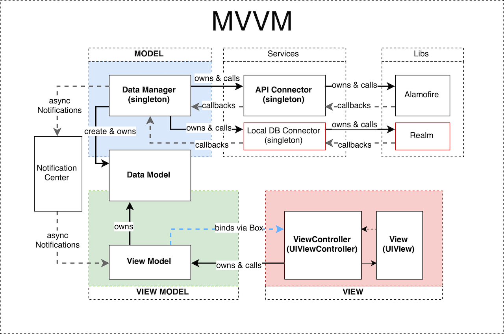

## Как запустить приложение
1. Скачать клон проекта
2. Подключить библиотеки с помощью Cococapods:
    - Установить Cocoapods, если его нет ([инструкция на официальном сайте](https://cocoapods.org))
    - Открыть терминал, перейти в папку с проектом (в которой расположен Podfile) с помощью команды ```cd```
    - Запустить команду ```pod install``` – библиотеки подключатся
3. Открыть workspace-файл проекта в XCode
4. Запустить проект в симуляторе/на устройстве (Выбрать симулятор, нажать клавиши ```Cmd+R```)


## Что можно увидеть в этом приложении и его исходном коде
- Как я проектирую интерфейс приложения по текстовому описанию в ТЗ
- Как я работаю с архитектурой
- Стиль кода и его оформление
- Мою работу с git (ветки и подписи к коммитам)
- Как я оформляю документацию (в том числе этот файл readme)


## Подход
При выполнении ТЗ я уделял большое внимание деталям и качеству работы приложения. 
Старался сделать его полноценным, чтобы оно выглядело приятно и современно, а функциями было удобно пользоваться.
Графику использовал из стандартного набора Эпл для разработчиков + мелочи сделал в [Figma](https://figma.com).

Добавил от себя (что не было явно указано в ТЗ):
1. счетчик контактов на основном экране
1. указание времени последнего обновления списка контактов
1. функция pull to refresh
1. переключение между полями ввода по нажатию кнопки "далее" на клавиатуре
1. формирование рабочей ссылки на случайную картинку при создании контакта (с помощью [pravatar.cc](http://pravatar.cc))
1. отображение контактов в списке по дате редактирования (последние редактированные вверху)
1. автоматическое закрывание экрана редактирования/создания контакта после успешной операции (через 3 секунды)


## Архитектура
Приложение построено по архитектуре MVVM. Интерфейсы с помощью Storyboard и autolayout.

Есть несколько базовых классов, от которых наследуются функциональные модули:
- **Model:**
  - ```BaseDataModel``` - пассивный объект, парсит данные, присылаемые с сервера, и хранит их в своих свойствах. Знает о структурах ответа сервера
  - ```BaseDataManager``` - менеджер данных, активный объект модели. Обращается в сеть/локальную БД за данными, также записывает и обрабатывает их. Сообщает вью модели об обновлениях через стандартный Notification Center
- **View:**
  - ```BaseViewController``` - это отображение данных. Непосредственно управляет UIView, владеет вью моделью и передает ей события, происходящие на экране
- **ViewModel:**
  - ```BaseViewModel``` - вью модель, содержит бизнес-логику получения и подготовки данных к отображению. Знает где получить данные (у менеджеров данных) и выполняет операции подготовки к отображению. Не содержит код UIKit и может быть протестирована автотестами

#### Архитектура этого приложения в виде схемы



## Библиотеки
Приложение использует 3 библиотеки, подключенные через Cococapods:
- [```Alamofire```](https://github.com/Alamofire/Alamofire) для работы с сетью
- [```SwiftyJSON```](https://github.com/SwiftyJSON/SwiftyJSON) для работы с ```JSON```-объектами, используется при парсинге данных
- [```SDWebImage```](https://github.com/SDWebImage/SDWebImage) для удобной загрузки картинок и отображения плейсхолдеров до загрузки


## Затраты
На проектирование и разработку ушло около 32-х часов чистого времени:
- 25 часов: работа с кодом и интерфейс билдером
- 7 часов: проектирование, декомпозиция задач и тестирование
